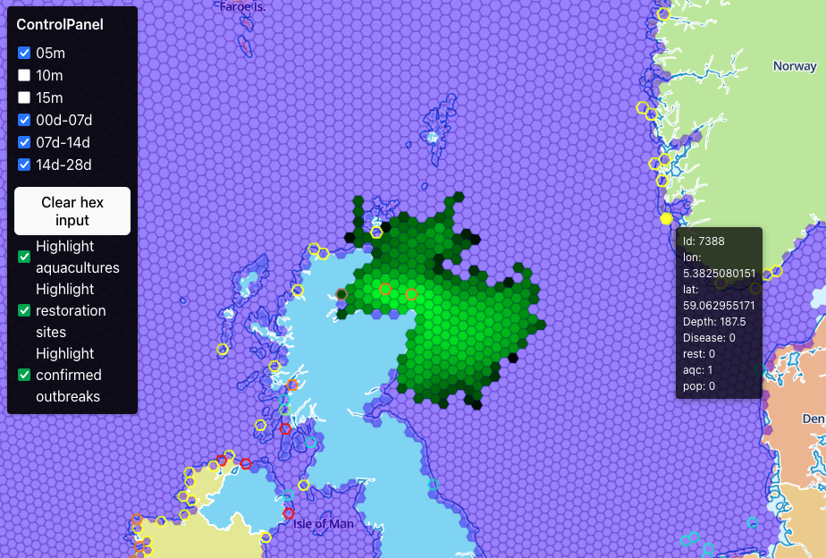

# OYSTERS

Visualization of simulated oyster larval dispersal connectivity in the North Sea.



## Quick Start

### Docker Compose (Recommended for Local Development)

Clone and enter the repository:

```bash
$ git clone https://github.com/geomar-od-lagrange/2024_hex_dashboard.git
$ cd 2024_hex_dashboard
```

Create environment file from example:

```bash
$ cp .env.example .env
```

Build and run (database auto-initializes):

```bash
$ docker compose build
$ docker compose up
```

Open http://localhost:5173/ in your browser.

### Kubernetes

Build and push images to your container registry:

```bash
$ docker compose build
$ docker tag 2024_hex_dashboard-api:latest <registry>/2024_hex_dashboard-api:latest
$ docker tag 2024_hex_dashboard-frontend:latest <registry>/2024_hex_dashboard-frontend:latest
$ docker tag 2024_hex_dashboard-db-init:latest <registry>/2024_hex_dashboard-db-init:latest
$ docker push <registry>/2024_hex_dashboard-api:latest
$ docker push <registry>/2024_hex_dashboard-frontend:latest
$ docker push <registry>/2024_hex_dashboard-db-init:latest
```

Update image references in `k8s/*-deployment.yaml` and `k8s/db-init-job.yaml`:
- Change: `image: 2024_hex_dashboard-api:latest`
- To: `image: <registry>/2024_hex_dashboard-api:latest`

Deploy to cluster:

```bash
$ kubectl apply -f k8s/
```

Monitor database initialization (takes ~3 minutes):

```bash
$ kubectl logs -f job/db-init
```

Set up external access using an Ingress resource.

### OpenShift

Follow the Kubernetes deployment steps above with these additional considerations:

- **Image registry**: Update manifests to reference OpenShift internal registry or your organization's registry
- **Security Context Constraints (SCC)**: Containers may need SCC adjustments or security contexts to run as non-root
- **External access**: Deploy the Route resource instead of an Ingress:
  ```bash
  $ oc apply -f k8s/openshift-route.yaml
  ```
- **Storage class**: Add explicit `storageClassName` to `k8s/db-pvc.yaml` (check available: `oc get storageclass`)

## Project Structure

```
.
├── api/                    # Node.js/Express API server
├── database/
│   ├── data/               # Processed data (parquet, geojson, json)
│   │   └── source/         # Original data + processing notebook
│   ├── init/               # Database init container
│   └── src/hex_db_loader/  # Python data loading package
├── frontend/               # React + deck.gl + MapLibre frontend
├── images/                 # Screenshots
├── k8s/                    # Kubernetes/OpenShift manifests
├── nginx/                  # Reverse proxy config
├── security/               # CVE scan results
├── volumes/                # Docker volumes (gitignored)
├── .env                    # Environment variables (gitignored)
├── .env.example            # Environment template
└── docker-compose.yml
```

## Development

### Prerequisites

- Docker (via [Docker Desktop](https://docs.docker.com/desktop/) or CLI)
- [pixi](https://pixi.sh/) (for Python development in `database/`)

### Running Locally

Foreground mode with live logs (Ctrl+C to stop):

```bash
$ docker compose up
```

Background mode:

```bash
$ docker compose up -d
$ docker compose logs -f
$ docker compose down
$ docker compose down -v  # also removes volumes
```

### Database Loaders

The database initializes automatically. For manual data loading:

```bash
$ cd database
$ pixi run python -m hex_db_loader.connectivity
$ pixi run python -m hex_db_loader.geojson
$ pixi run python -m hex_db_loader.metadata
```

## License

MIT License. See [LICENSE](LICENSE).

## Contributors

- Willi Rath ([@willirath](https://github.com/willirath))
- Ingmar Eissfeldt ([@IngmarEissfeldt](https://github.com/ingmareissfeldt))
- Felix Kirch ([@felixkirch](https://github.com/felixkirch))
- Lara Schmittmann ([@laraschmittmann](https://github.com/laraschmittmann))
