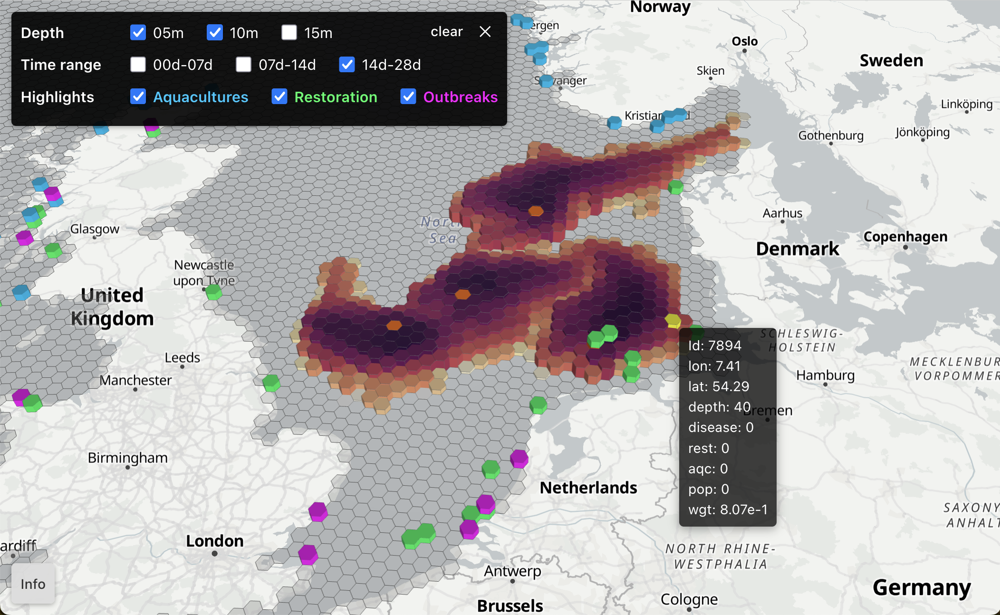

# OSTREA

Oyster Spatio-Temporal Dispersal Atlas - Visualization of simulated oyster larval dispersal connectivity in the North Sea.



## Quick Start

### Docker Compose (Recommended for Local Development)

Clone and enter the repository:

```bash
git clone https://github.com/geomar-od-lagrange/2024_hex_dashboard.git
cd 2024_hex_dashboard
```

Create environment file from example:

```bash
cp .env.example .env
```

Build and run (database auto-initializes):

```bash
docker compose build
docker compose up
```

Open http://localhost:5173/ in your browser.

### Kubernetes (OpenShift)

The Helm chart in `helm/ostrea/` deploys to OpenShift clusters using Routes for ingress.

Build and push images:

```bash
docker compose build
docker tag ostrea-api:latest <registry>/ostrea-api:latest
docker tag ostrea-frontend:latest <registry>/ostrea-frontend:latest
docker tag ostrea-db-init:latest <registry>/ostrea-db-init:latest
docker push <registry>/ostrea-api:latest
docker push <registry>/ostrea-frontend:latest
docker push <registry>/ostrea-db-init:latest
```

Create namespace and secret:

```bash
kubectl create namespace ostrea
kubectl create secret generic db-secret \
  --from-literal=POSTGRES_USER=user \
  --from-literal=POSTGRES_PASSWORD=$(openssl rand -base64 24) \
  --from-literal=POSTGRES_DB=db \
  -n ostrea
```

Deploy with Helm:

```bash
helm template ostrea ./helm/ostrea \
  --set registry=<registry>/ \
  | kubectl apply --namespace ostrea -f -
```

Monitor deployment:

```bash
kubectl get pods -n ostrea
kubectl logs -f job/db-init -n ostrea
```

For local OpenShift testing with MicroShift, see [docs/microshift-deployment-test.md](docs/microshift-deployment-test.md).

## Project Structure

```
.
├── api/                    # Node.js/Express API server
├── database/
│   ├── data/               # Processed data (parquet, geojson, json)
│   │   └── source/         # Original data + processing notebook
│   ├── init/               # Database init container
│   └── src/hex_db_loader/  # Python data loading package
├── frontend/               # React + deck.gl + MapLibre frontend
├── helm/ostrea/            # Helm chart for OpenShift deployment
├── images/                 # Screenshots
├── security/               # CVE scan results
├── volumes/                # Docker volumes (gitignored)
├── .env                    # Environment variables (gitignored)
├── .env.example            # Environment template
└── docker-compose.yml
```

## Development

### Prerequisites

- Docker (via [Docker Desktop](https://docs.docker.com/desktop/) or CLI)
- [pixi](https://pixi.sh/) (for Python development in `database/`)

### Running Locally

Foreground mode with live logs (Ctrl+C to stop):

```bash
docker compose up
```

Background mode:

```bash
docker compose up -d
docker compose logs -f
docker compose down
docker compose down -v  # also removes volumes
```

### Database Loaders

The database initializes automatically. For manual data loading:

```bash
cd database
pixi run python -m hex_db_loader.connectivity
pixi run python -m hex_db_loader.geojson
pixi run python -m hex_db_loader.metadata
```

## License

MIT License. See [LICENSE](LICENSE).

## Contributors

- Willi Rath ([@willirath](https://github.com/willirath))
- Ingmar Eissfeldt ([@IngmarEissfeldt](https://github.com/ingmareissfeldt))
- Felix Kirch ([@felixkirch](https://github.com/felixkirch))
- Lara Schmittmann ([@laraschmittmann](https://github.com/laraschmittmann))
